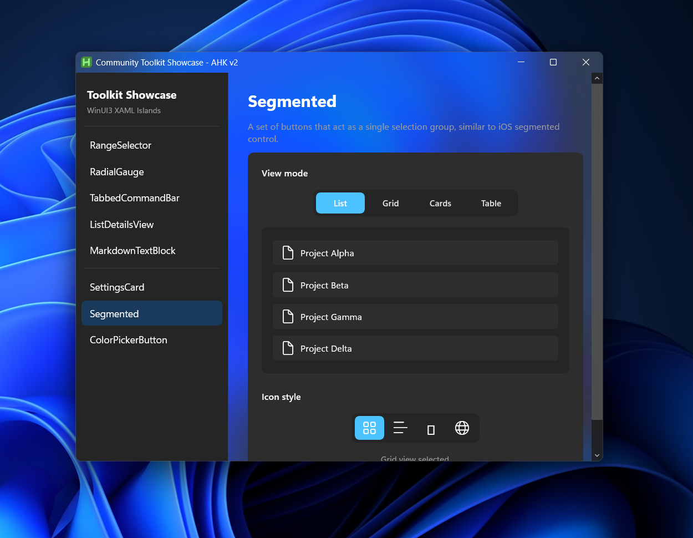
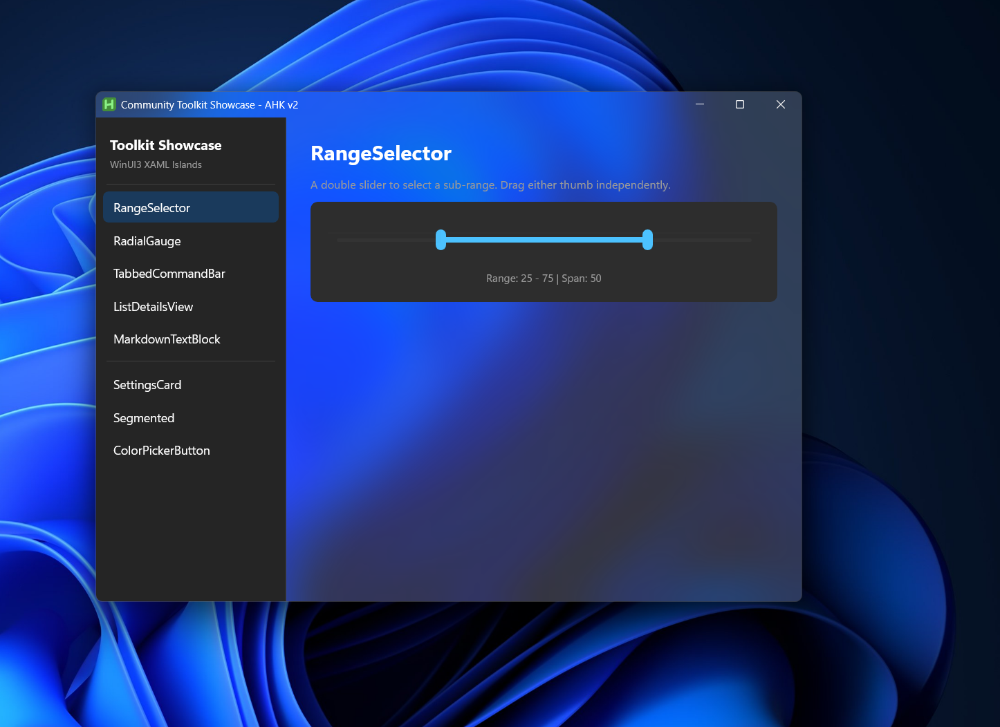
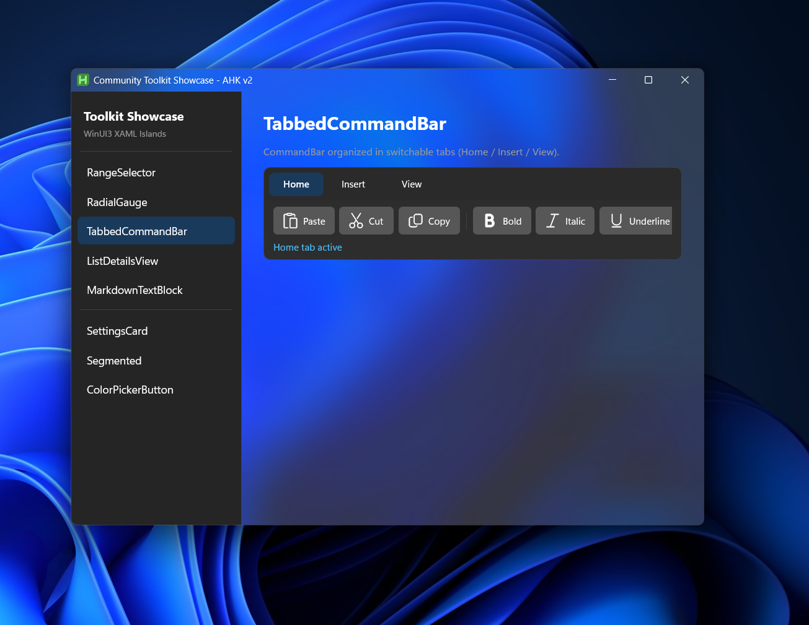
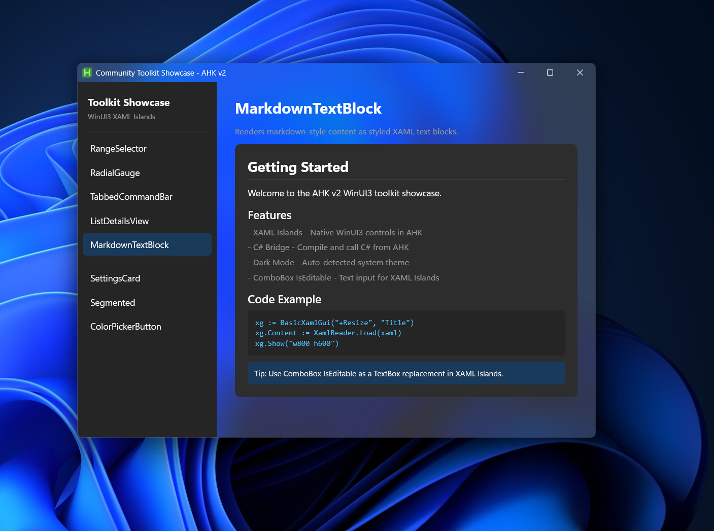
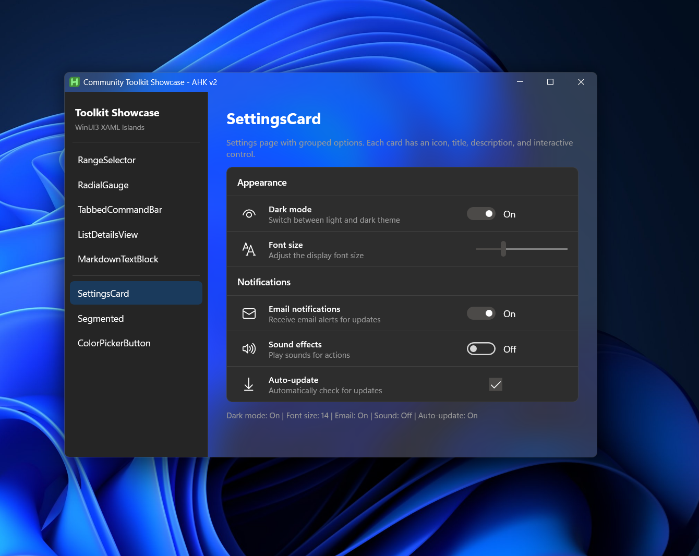

# WinUI3-AHK

Native WinUI3 controls in AutoHotkey v2 via XAML Islands and direct WinRT interop.

## Screenshots

### Segmented Control


### Range Selector


### Tabbed Command Bar


### Markdown Text Block


### Settings Cards


## Features

- Host WinUI3 XAML controls directly in AHK v2 windows via XAML Islands
- Full Windows App SDK 1.6 support via WinRT COM interop
- Dark mode / Mica backdrop theming
- C# bridge for runtime compilation of .NET components
- WinUI3 Community Toolkit control support (SettingsCard, Segmented, RangeSelector, etc.)

## Requirements

- Windows 10 1903+ or Windows 11
- AutoHotkey v2.1-alpha.14+
- [Windows App Runtime 1.6+](https://learn.microsoft.com/en-us/windows/apps/windows-app-sdk/downloads)
- .NET 8+ Runtime (for CSharpBridge features)

## Quick Start

```ahk
#Requires AutoHotkey v2.1-alpha.14
#Include WinRT\winrt.ahk
#Include WinRT\AppPackage.ahk
#Include Lib\BasicXamlGui.ahk

UseWindowsAppRuntime('1.6')
DQC := WinRT('Microsoft.UI.Dispatching.DispatcherQueueController').CreateOnCurrentThread()
OnExit((*) => DQC.ShutdownQueue())

xg := BasicXamlGui('+Resize', 'Hello WinUI3')
ApplyThemeToXamlGui(xg)

xg.Content := WinRT('Microsoft.UI.Xaml.Markup.XamlReader').Load("
(
    <StackPanel xmlns='http://schemas.microsoft.com/winfx/2006/xaml/presentation'
                Padding='32' Spacing='16' HorizontalAlignment='Center' VerticalAlignment='Center'>
        <TextBlock Text='Hello, WinUI3!' FontSize='32' FontWeight='Bold'/>
        <Button x:Name='ClickBtn' Content='Click Me' HorizontalAlignment='Center'/>
    </StackPanel>
)")
ApplyXamlTheme(xg)
xg.Show("w500 h350")
```

## Demos

| Script | Description |
|--------|-------------|
| `HelloWorld_WinUI3.ahk` | Minimal WinUI3 hello world with button click |
| `WinUI3_Toolkit_Showcase.ahk` | 8-page showcase of WinUI3 Community Toolkit controls |
| `WinUI3_TableView_Test.ahk` | C# TableView data grid with runtime .NET compilation |
| `WinUI3_CSharpBridge_Demo.ahk` | Advanced C# bridge demo (requires full XAML host) |

## Project Structure

```
WinUI3-AHK/
├── HelloWorld_WinUI3.ahk          # Minimal demo
├── WinUI3_Toolkit_Showcase.ahk    # Toolkit controls showcase
├── WinUI3_TableView_Test.ahk      # DataGrid / TableView demo
├── WinUI3_CSharpBridge_Demo.ahk   # C# bridge demo
├── Lib/
│   ├── BasicXamlGui.ahk           # XAML Island host wrapper
│   └── CSharpBridge.ahk           # Runtime C# compilation
├── WinRT/                         # WinRT interop library
│   ├── winrt.ahk                  # Core WinRT class
│   ├── AppPackage.ahk             # Windows App Runtime loader
│   ├── ffi.ahk                    # FFI type definitions
│   ├── rtmetadata.ahk             # WinRT metadata resolution
│   ├── rtinterface.ahk            # WinRT interface wrappers
│   └── ...
└── DotNet.ahk/                    # .NET CLR hosting library
    ├── DotNet.ahk                 # Core .NET runtime host
    └── ...
```

## Key Components

### WinRT Library (`WinRT/`)
Core WinRT API bindings for AutoHotkey v2:
- `WinRT(classname)` - Creates runtime objects
- `WinRT(rtobj)` - Casts to derived class
- `WinRT.GetType(name)` - Gets type information

### AppPackage.ahk
Handles Windows App SDK initialization:
- `UseWindowsAppRuntime(version)` - Loads specific SDK version
- Automatic package graph management

### BasicXamlGui
Wrapper class extending `Gui` with XAML island support:
- Automatic DesktopWindowXamlSource creation
- Keyboard input handling
- Focus navigation

## Windows App SDK Metadata Fixes

This fork includes fixes to `rtmetadata.ahk` and `rtinterface.ahk` for Windows App SDK compatibility:

- **Assembly reference resolution**: WinUI SDK metadata uses different assembly ref names (`"Windows"`, `"Windows.Foundation.FoundationContract"`) than the base Windows Runtime (`"Windows.Foundation"`). The attribute cache now searches all variants.
- **Multiple constructor overloads**: `StaticAttribute` in WinUI SDK has multiple constructor MemberRefs. The metadata resolver now stores and iterates arrays of tokens.

## Dark Mode Support

```ahk
; Detect system theme
DarkModeIsActive() {
    clr := WinRT('Windows.UI.ViewManagement.UISettings')().GetColorValue('Foreground')
    return ((5 * clr.G) + (2 * clr.R) + clr.B) > (8 * 128)
}

; Apply dark title bar
SetDarkWindowFrame(hwnd, true)

; Enable Mica backdrop
DllCall("dwmapi\DwmSetWindowAttribute", 'ptr', hwnd, 'uint', 38, 'int*', 3, 'int', 4)
```

## Troubleshooting

### "Windows App Runtime not found"
Install Windows App SDK from: https://learn.microsoft.com/windows/apps/windows-app-sdk/downloads

### "Type not found" errors
Ensure you're using the correct SDK version in `UseWindowsAppRuntime()`.

### XAML controls not rendering
Check that:
1. DispatcherQueueController is created before any XAML operations
2. The GUI has `-DPIScale` option set
3. XAML namespace declarations are correct

## Credits

### WinRT Library
The WinRT library is based on [thqby/winrt.ahk](https://github.com/thqby/ahk2_lib), released under the **Unlicense** (public domain).

### Related Projects
- [AutoHotkey](https://www.autohotkey.com/) - Scripting language for Windows
- [Windows App SDK](https://github.com/microsoft/WindowsAppSDK) - Microsoft's modern app platform
- [WinUI 3](https://github.com/microsoft/microsoft-ui-xaml) - Native UI platform for Windows

## License

The WinRT library components are released under the **Unlicense** (public domain).
See [WinRT/UNLICENSE](WinRT/UNLICENSE) for details.
