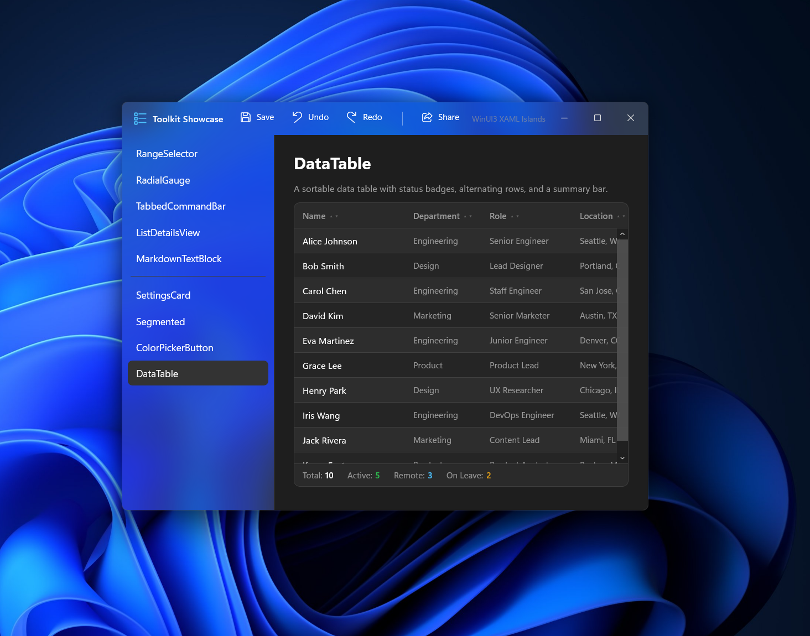
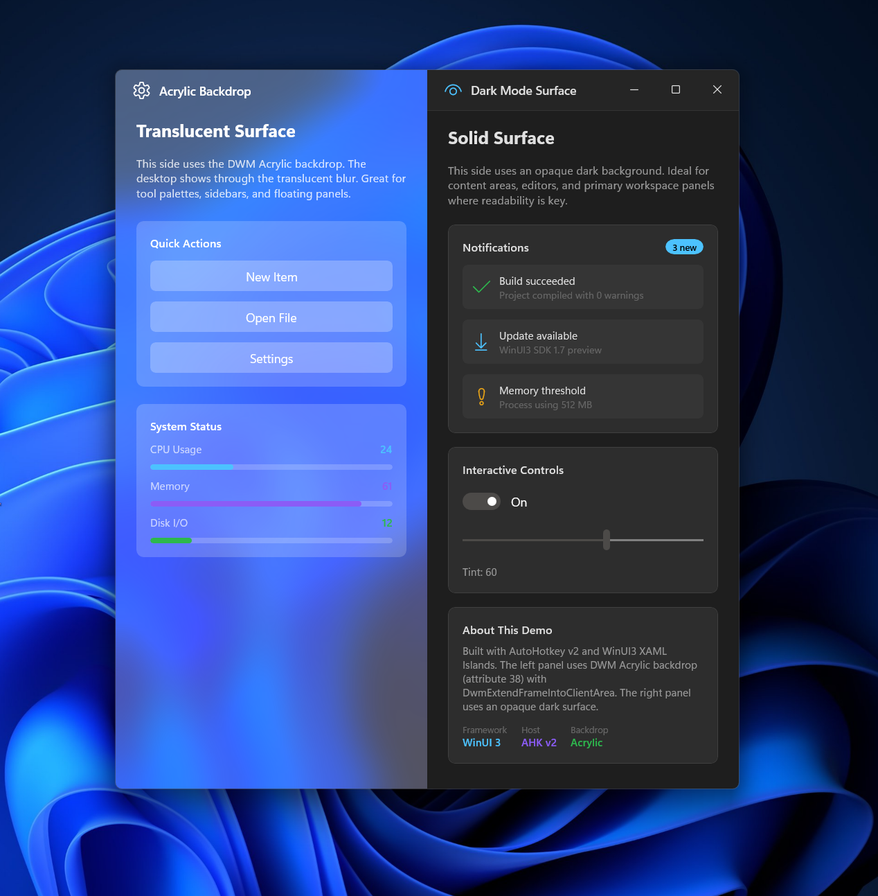

# WinUI3

Native WinUI3 controls in AutoHotkey v2 via XAML Islands and direct WinRT interop.

## Screenshots

### Toolkit Showcase


### Acrylic / Dark Mode Split


### Segmented Control


### Range Selector


### Tabbed Command Bar


### Settings Cards


## Quick Start

```ahk
#Requires AutoHotkey v2.1-alpha.14
#Include WinRT\winrt.ahk
#Include WinRT\AppPackage.ahk
#Include Lib\BasicXamlGui.ahk

UseWindowsAppRuntime('1.6')
DQC := WinRT('Microsoft.UI.Dispatching.DispatcherQueueController').CreateOnCurrentThread()
OnExit((*) => DQC.ShutdownQueue())

xg := BasicXamlGui('+Resize', 'Hello WinUI3')
ApplyThemeToXamlGui(xg)

xg.Content := WinRT('Microsoft.UI.Xaml.Markup.XamlReader').Load("
(
    <StackPanel xmlns='http://schemas.microsoft.com/winfx/2006/xaml/presentation'
                Padding='32' Spacing='16' HorizontalAlignment='Center' VerticalAlignment='Center'>
        <TextBlock Text='Hello, WinUI3!' FontSize='32' FontWeight='Bold'/>
        <Button x:Name='ClickBtn' Content='Click Me' HorizontalAlignment='Center'/>
    </StackPanel>
)")
ApplyXamlTheme(xg)
xg.Show("w500 h350")
```

## Requirements

- AutoHotkey v2.1-alpha.14+
- Windows 10/11
- [Windows App SDK 1.6+](https://learn.microsoft.com/windows/apps/windows-app-sdk/downloads)

## Credits

- **[Lex](https://github.com/lexikos)** — Creator of [WinRT.ahk](https://github.com/lexikos/winrt.ahk), the WinRT interop layer this project builds on
- **[thqby](https://github.com/thqby)** — Extended WinRT library ([ahk2_lib](https://github.com/thqby/ahk2_lib), Unlicense)
- **[Florence](https://github.com/G33kDude)** — [DotNet.ahk](https://github.com/G33kDude/DotNet.ahk), the .NET CLR hosting library used by the C# bridge
